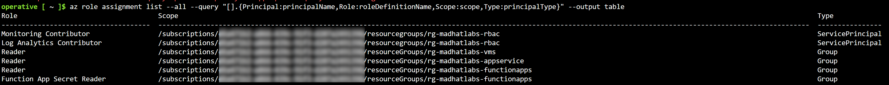
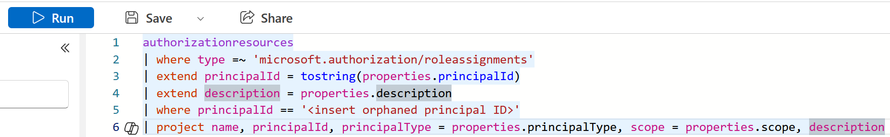
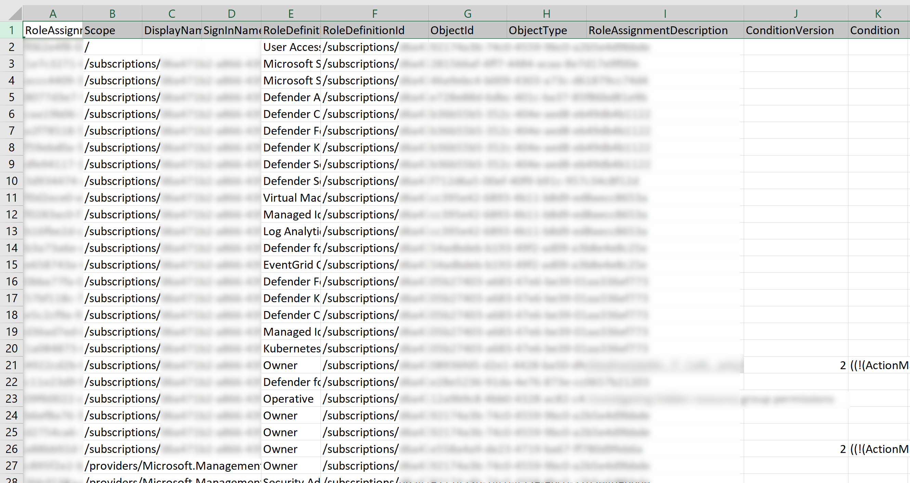

# Privilege Audit

## Overview

This audit examined role-based access control (RBAC) and privileged access within a live Azure training environment. The goal was to identify excessive, unnecessary, or potentially dangerous permissions and understand how different Azure auditing methods expose different types of access.

Rather than relying on a single tool, I investigated access using the Azure IAM portal and role assignment export, Azure CLI, Azure Resource Graph, and Privileged Identity Management (PIM). Each method provided a different view of the environment and revealed limitations that could affect a real-world access review.

## Scope and Methodology

The audit focused on Azure role assignments and privileged access. My account initially had limited access, with an additional PIM-eligible role available for activation when elevated permissions were required.

I used four methods during the audit:

1. **Azure IAM / Role Assignment Export** — reviewed role assignments at specific scopes and exported assignment data for deeper analysis.
2. **Azure CLI** — enumerated role assignments programmatically and compared the results with the Azure portal.
3. **Azure Resource Graph (KQL)** — queried role assignments across the environment instead of reviewing individual scopes manually.
4. **Privileged Identity Management (PIM)** — examined eligible versus active privileged access and activated eligible access when required.

## Audit Findings

### Finding 1 — Orphaned Role Assignment
**Severity: High**

The audit identified a role assignment associated with a principal that no longer exists. The role assignment remained even though the identity it originally belonged to was deleted.

This is a security concern because Azure role assignments reference the principal by its object ID. Leaving the assignment behind creates unnecessary privileged access and makes the environment harder to audit and maintain.

**Recommendation:** Remove orphaned role assignments after confirming the associated principal has been deleted and the assignment is no longer required.

*Figure 1 — Azure CLI role assignment enumeration used to identify assignments associated with missing or unresolved principals.*

### Finding 2 — Redundant Owner Role Assignments
**Severity: High**

The audit identified multiple Owner role assignments across different scopes. Several of these assignments appeared redundant because Owner access was granted more broadly or repeatedly than necessary.

Owner is a highly privileged role that provides extensive control over Azure resources, including the ability to manage access. Redundant Owner assignments increase the attack surface and make access management more difficult to audit.

**Recommendation:** Remove unnecessary Owner assignments and replace them with the narrowest job-function role at the smallest required scope.

*Figure 2 — Azure Resource Graph query used to examine role assignments and identify potentially excessive or redundant privileged access.*

### Finding 3 — Standing Privileged Access
**Severity: High**

The audit identified privileged access that was assigned permanently rather than managed through Privileged Identity Management (PIM) as eligible access.

Standing privileged access increases risk because permissions remain available even when not actively needed. PIM reduces this exposure by allowing privileged roles to be activated only when required.

**Recommendation:** Move standing privileged access to PIM-eligible assignments where appropriate and require activation only when elevated permissions are needed.

*Figure 3 — Redacted Azure RBAC export showing active and permanent role assignments used to identify standing privileged access.*

### Finding 4 — PIM-Eligible Privileged Access
**Severity: Medium**

The PIM review identified privileged roles that were configured as eligible rather than permanently active. This showed that privileged access can be made available when needed without granting continuous elevated permissions.

Reviewing PIM also provided visibility into whether privileged roles were eligible or active and when elevated access had been activated.

**Recommendation:** Continue using PIM for privileged roles and require justification, MFA, and time-limited activation for elevated access where appropriate.

*Figure 4 — Azure Privileged Identity Management (PIM) showing an eligible role assignment that can be activated when elevated access is required.*

### Finding 5 — Over-Provisioned Account
**Severity: High**

By combining the results from the different auditing methods, I identified an account with more privileged access than was necessary for its intended function.

This finding demonstrated why relying on a single auditing method can leave gaps. Comparing RBAC assignments, scope, and PIM information provided the context needed to recognize the excessive access.

**Recommendation:** Apply least privilege by removing unnecessary permissions, assigning the narrowest role required for the account's function, and using PIM for privileged access where appropriate.

## Methodology Comparison

| Method | What It Sees | What It Misses |
|---|---|---|
| Azure IAM / Role Assignment Export | Active assignments at a specific scope, including inherited assignments | Group membership and orphaned principals can be difficult to identify |
| Azure CLI | Role assignments plus null principal names that can reveal orphaned assignments | Reviews one scope per command/run |
| Azure Resource Graph (KQL) | Role assignments across the environment in a single query | Eligible PIM assignments |
| Privileged Identity Management (PIM) | Eligible vs. active privileged access and activation history | Standing assignments that are outside PIM |

## Conclusion

This audit demonstrated that no single Azure access-review method provides a complete picture of privileged access. The IAM portal, Azure CLI, Resource Graph, and PIM each exposed different information and different blind spots.

The biggest lesson was the importance of comparing results across multiple tools. Doing so made it possible to identify orphaned assignments, excessive Owner permissions, standing privileged access, and over-provisioned accounts that could otherwise be overlooked.

Regular access reviews, least-privilege role assignments, and PIM for elevated access can reduce these risks and make privileged access easier to monitor.

