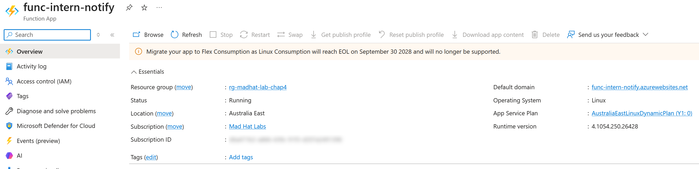
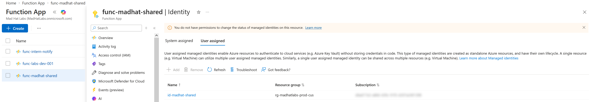
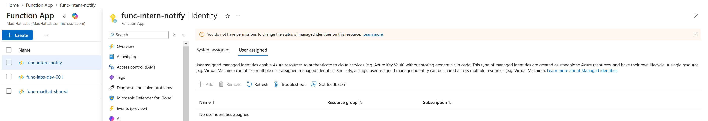
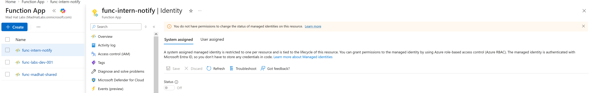
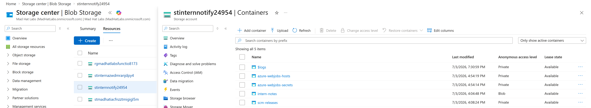
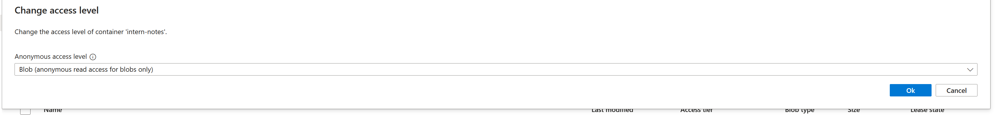
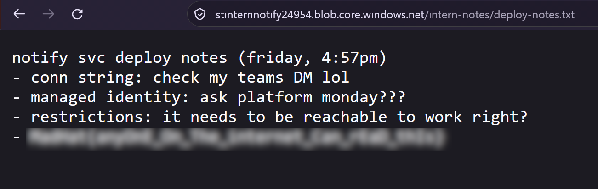
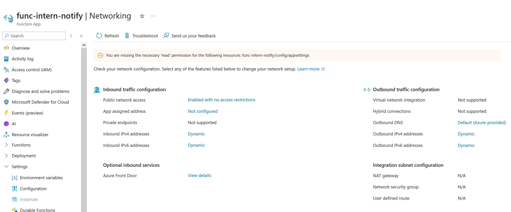

# Azure Security Review: The Friday Deploy

## Scenario

This investigation involved reviewing a new Azure deployment before it went into production. I compared it against an existing production environment to identify security issues and determine what needed to be fixed first.

## Environment

**Platform:** Live Azure training tenant

**Services and tools:** Microsoft Azure Portal, Azure Functions, Blob Storage, Microsoft Entra ID

**Access level:** Reader access

## Investigation

### 1. The Where

The new Function App was deployed in a different Azure region from the production environment. This could increase latency, cause additional inter-region data transfer costs, and create potential data residency concerns.

Deploying resources in the wrong region can also result in unnecessary expenses and performance issues.

**Evidence:** Azure Function App Overview showing the deployment in Australia East.

### 2. The Who

The new application was missing a managed identity, unlike the production application. Without one, developers may rely on stored credentials to authenticate to Azure services, increasing the risk of credential exposure.

**Evidence:** The production Function App uses a user-assigned managed identity, establishing the expected configuration baseline.

**Evidence: New Function App has no user-assigned managed identity.**

**Evidence: System-assigned managed identity is disabled.**

### 3. The Leak

I discovered a storage container configured for anonymous public access. To verify the exposure, I copied a blob URL and opened it in a private browser window without signing into Azure.

The file loaded successfully, confirming that anyone with the URL could access its contents without authentication.

**Evidence 1: Storage container configured for anonymous Blob access.**

**Evidence 2: Anonymous Blob access configuration.**

**Evidence 3: Successful unauthenticated Blob access.**

### 4. The Door

The new Function App allowed inbound traffic from all networks without restrictive access rules. The production application had stricter network restrictions.

This increased the application's attack surface, although it did not prove the application was compromised.

**Evidence:** The Function App's inbound traffic configuration shows public network access enabled without access restrictions.

  

## Priority Call

Of the four findings, I prioritized the publicly accessible storage container because it was the only confirmed active exposure.

The other issues were configuration weaknesses, but the storage file was already accessible without authentication.

**Exposure beats hygiene. Active beats potential.**

## What Broke / What Surprised Me

What surprised me was that a simple storage setting could be more dangerous than several other security misconfigurations. I initially viewed all four findings as problems, but verifying the public file access helped me understand why some risks require immediate attention.

## Findings and Recommendations

I recommended immediately disabling anonymous access to the storage container and reviewing its contents for sensitive information.

The remaining fixes included configuring a managed identity with least-privilege permissions, removing stored credentials, restricting inbound traffic with an explicit deny rule, and redeploying the application to the approved region.

Automated pre-deployment security checks could help prevent these issues from happening again.
