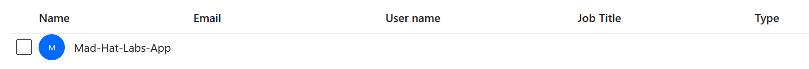

# Azure Identity Investigation: The Stolen Identity

## Scenario

This investigation involved reconstructing a five-stage OAuth consent-phishing attack within a live Azure training tenant. I investigated two linked application registrations to determine how the attacker gained access, escalated privileges, established persistence, and created a path for harvesting tokens.

## Environment

Platform: Live multi-user Azure training tenant

Services and tools: Microsoft Azure Portal, Microsoft Entra ID, App registrations

Access level: Reader access

## Investigation

### 1. Entry

The user was phished and completed MFA. From there, the attacker stole the resulting session token, which already contained an MFA-satisfied claim. The attacker was able to bypass Conditional Access. Once the account was compromised, it also retained Owner rights over a legacy application registration, which gave the attacker a path to the next stage of the attack.

### 2. Escalate

Once the account was compromised, the attacker took advantage of its Owner rights over the legacy application. A new client secret was created with an expiration date set far into the future. This allowed the attacker to authenticate as the application's service principal and utilize its existing Microsoft Graph permissions without needing to sign in through the compromised user again.

### 3. Pivot

If the newly created client secret was discovered or revoked, the attacker needed another way to maintain control. So the attacker used a separate rogue application and added its service principal as an Owner of the legacy application. The rogue application gained ownership rights over the legacy app, allowing the attacker to create new credentials again even if the original client secret was removed.

### 4. Persist

The attacker established persistence by creating a custom API scope on the legacy application. This allowed the rogue application to request delegated access to the legacy app, creating another way for the attacker to maintain access even after the original compromised account or client secret was dealt with.

### 5. Loot

By combining the rogue application's client ID, the custom API scope, and an attacker-controlled redirect URI, the attacker created a consent-phishing URL. Once a victim was already signed in to their account and accepted the consent prompt, the authorization code would be redirected to the attacker's server. From there, the attacker was able to harvest the target's authorization and gain access through the permissions that were granted.

## Why This Attack Works

This attack works because consent phishing does not require the attacker to steal the victim's password again. The victim is already authenticated and completes MFA, allowing the stolen session token to contain an MFA-satisfied claim. The attacker can then abuse application permissions and OAuth consent to maintain access. Resetting the user's password, revoking their sessions, or requiring MFA would not necessarily remove the OAuth permissions that were already granted.

## What Broke / What Surprised Me

What surprised me was how application ownership could provide another path for an attacker even after the original account was secured. I originally thought resetting the password, revoking sessions, and enforcing MFA would be enough to stop the attack. However, the attacker could establish persistence through client secrets, application ownership, and OAuth permissions that could remain after the user's account was secured.

## Findings and Recommendations

The investigation identified excessive Microsoft Graph permissions, a long-lived client secret, rogue application ownership, and a custom API scope. To contain the attack, I would revoke the malicious credentials and OAuth grant, remove the rogue application as an Owner, and remove unnecessary permissions. Regular audits of application registrations and Owners would also help prevent similar attacks.
